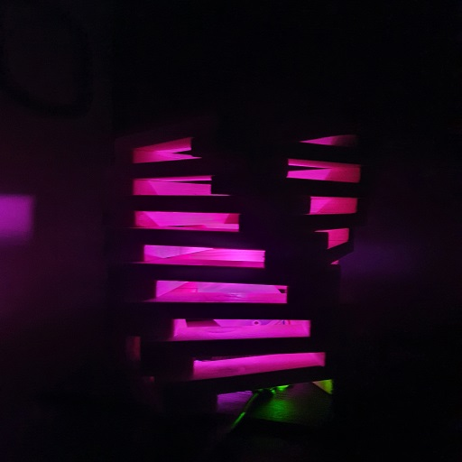
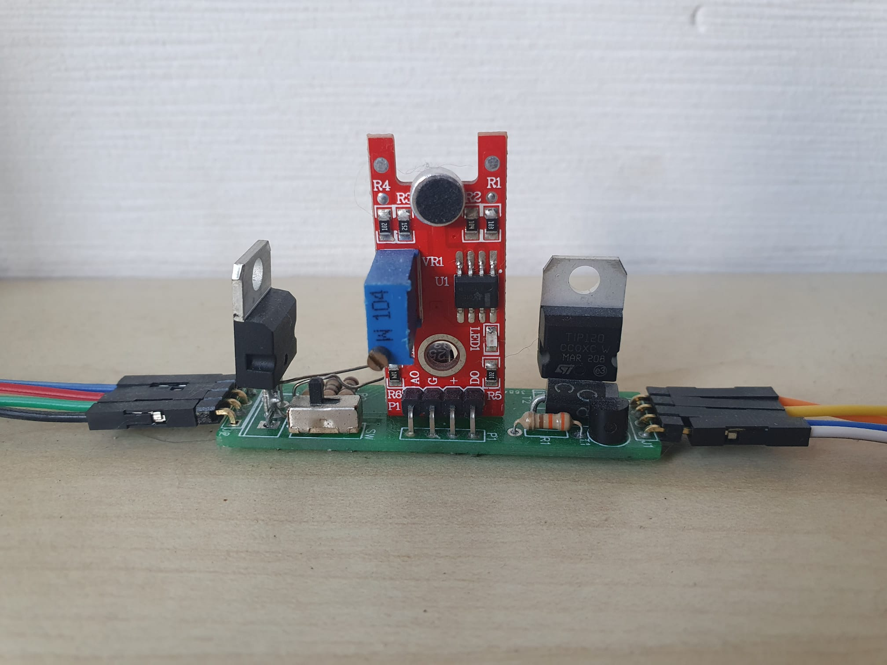
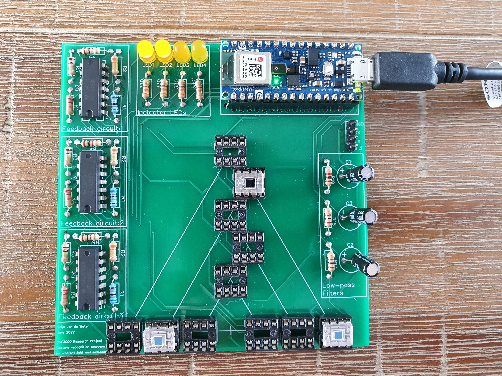
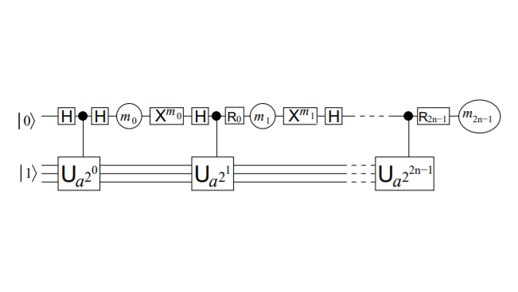
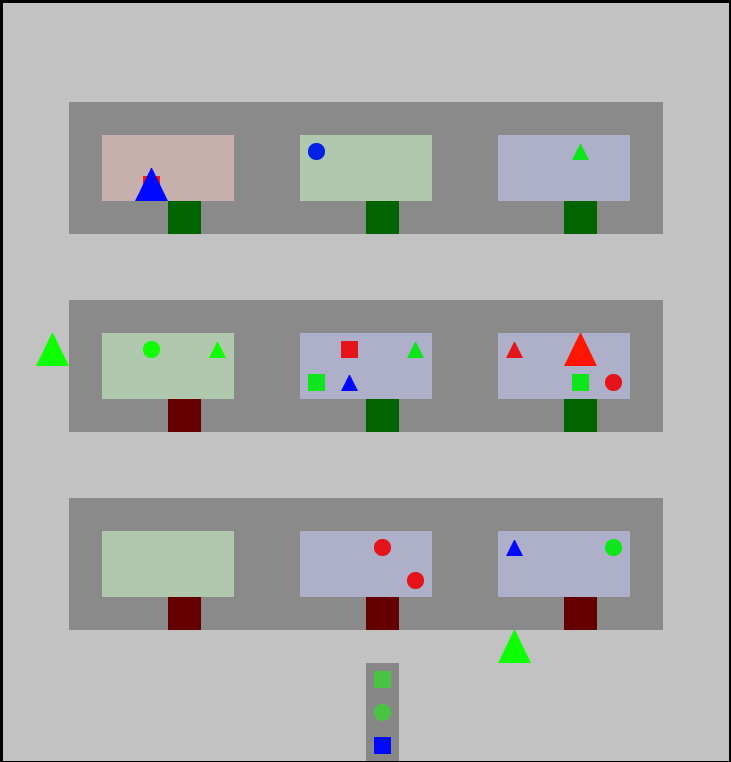
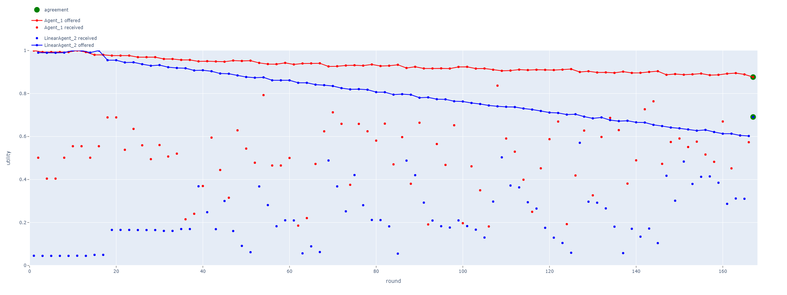

# Project-Overview

## Personal projects
Name | Programming Language / Technologies | Image
--- | --- | ---
[Remote controlled lamp](https://github.com/StijnW66/lamp-system) | C/C++, Java, Python, SQL, Webserver, Database, PCB design, Embedded Systems (Raspberry pi, ESP32) | 
[Sound reactive Led Strip](https://oshwlab.com/StijnW66/music_led) | Electrical Engineering, PCB design | 

## University projects

Name | Programming Language / Technologies | Image
--- | --- | ---
[CSE3000 Research Project - Gesture Recognition Empowered by Ambient Light and Embedded AI](https://github.com/StijnW66/CSE3000-Gesture-Recognition/tree/Stijn) | C/C++, Python, PCB design | 
[TN3175 Quantum Engineering Group Project - A 2n+3 Qubit implementation of Shor's Algorithm](https://github.com/StijnW66/Quantum-Project) | Python, Qiskit (Quantum Computation) | 
[A clone of JQ (command line JSON processor) in Haskell](https://gitlab.ewi.tudelft.nl/cse3100/2021-2022/fp-stijnvandewate) | Haskell | -
[Collaborative AI: Block World For Teams](https://github.com/yuanzexiong/CSE3210-BW4T) | Python, AI | 
[Collaborative AI: Negotiating Agents](https://github.com/yuanzexiong/CSE3210-Negotiation) | Python, AI | 

## Additional experience
[Rust]
[OpenGL]
[TinyML]
[Stm32]

## Project ideass
